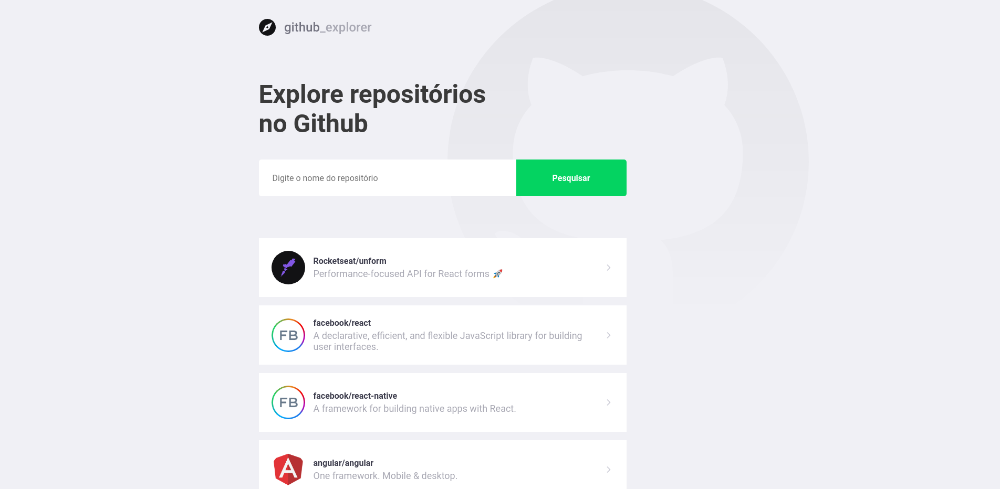
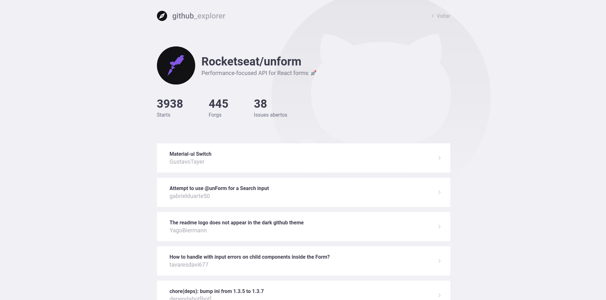

<h3 align="center">

</h3>

<br>
<br>

<div align="center">

  
</div>

<br>
<br>
<br>

## 🚀 Technologies

This project was developed with the following technologies:

- ✔️ ReactJS
- ✔️ TypeScript
- ✔️ Styled Components
- ✔️ Axios

<br>

## Installation


```bash
$ git clone https://github.com/gahtenorio/github-explorer-react.git
$ cd github-explorer-react
$ yarn
```

## Run

```bash
$ yarn start
```
<br>

### Instagram: [@tenoriogah](https://www.instagram.com/tenoriogah)
